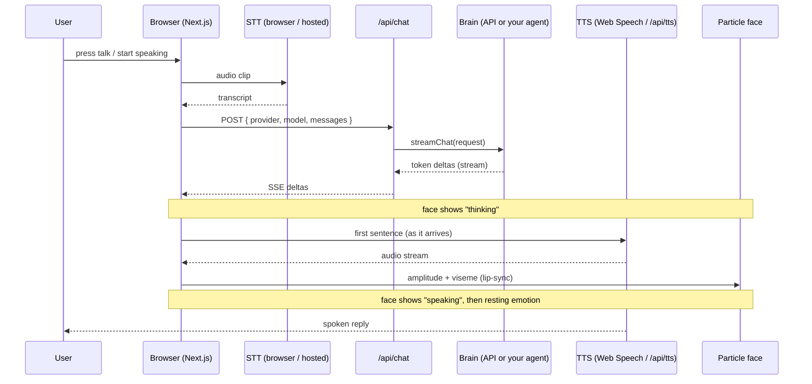

# Architecture

How the pieces fit: the voice loop, the deploy boundary, the security model, and
the repo layout. This is the map for anyone extending the app or wiring a new
brain. For the brain contract specifically, see
[`backends.md`](backends.md); for the exact env variables, see
[`../../../docs/env-contract.md`](../../../docs/env-contract.md).

---

## The runtime flow

Everything heavy runs **in the browser**. The server is a thin set of API
routes whose only job is to hold secrets and fan out to providers.

```
mic ─▶ MediaRecorder ─▶ STT (browser Whisper  OR  /api/transcribe hosted)
                             │
                             ▼
                        transcript ─▶ /api/chat (your brain, streamed SSE)
                             │
                             ▼
        reply text ─▶ TTS (Web Speech  OR  /api/tts streamed audio)
                             │
                             ├─▶ speaker
                             └─▶ wawa-lipsync analyser ─▶ 12-emotion particle face
```

1. **Capture** — `getUserMedia` + `MediaRecorder` record an opus clip
   (push-to-talk) or a Silero-VAD segment (hands-free).
2. **Transcribe** — the browser Whisper worker (transformers.js, WebGPU with a
   WASM fallback) runs offline by default; on failure or by choice it POSTs the
   clip to **`/api/transcribe`**, which forwards to a hosted Whisper.
3. **Chat** — the transcript is appended to the conversation and POSTed to
   **`/api/chat`**, which resolves a `ChatAdapter` and streams tokens back as
   Server-Sent Events.
4. **Speak** — the reply streams sentence-by-sentence into TTS: browser **Web
   Speech** (zero infra, mouth from an estimated envelope) or streamed
   **`/api/tts`** audio (real FFT-driven lip-sync).
5. **Face** — the audible audio is tapped by `wawa-lipsync`; amplitude + viseme
   drive the mouth particles, and a lifecycle emotion machine steers expression
   (`thinking` while streaming, `speaking` while audio plays, then the resting
   emotion, optionally overridden by a `[[face:<emotion>]]` directive).

### Voice loop — sequence diagram



The brain is the **only** swappable box: it can be a hosted API (Mode A) or your
own already-running agent (Mode B). Both satisfy the same streaming contract, so
nothing else in the loop changes.

---

## The deploy boundary

The same app runs in two places; the only difference is where the brain lives
and whether the agent-bridge can reach it.

| | **Vercel** (hosted) | **Self-host** (Docker on your VPS) |
|---|---|---|
| Static UI + API routes | Vercel CDN + serverless functions | `next start` in a container |
| Mode A brains | ✅ just add a key | ✅ just add a key |
| Mode B agent-bridge | Only when the agent is on a **public HTTPS / tunnel** URL (or `ALLOW_AGENT_BRIDGE_IN_PROD=1`) | Reaches the agent over the **private network — no tunnel** (`SELF_HOST=1`) |
| Best when | You use a hosted key, or your agent is already public | You want the face **next to** an agent you already run |

A serverless function cannot reach a private `localhost` address, which is why
Mode B on Vercel needs a public endpoint. Self-hosting next to the agent is the
zero-tunnel path. Full steps in [`deploy.md`](deploy.md).

---

## The security model

**All provider secrets are server-side only.** They are read exclusively inside
the `app/api/*` route handlers and are never prefixed with the client-exposed
`NEXT_PUBLIC_` marker, so they never ship to the browser.

- The browser learns *whether* a capability exists — which brains, STT, and TTS
  are configured — from **`/api/config`**, which returns **booleans only** (plus
  non-secret model ids). No key value or partial secret ever crosses the wire.
- `/api/chat`, `/api/transcribe`, and `/api/tts` read `process.env` server-side
  and forward to the upstream provider; nothing echoes a key back.
- Missing keys degrade gracefully instead of failing — see
  [`backends.md`](backends.md#graceful-degradation).

---

## Repo layout

```
claude-faces/
├─ app/
│  ├─ layout.tsx, page.tsx, globals.css   # the Next.js App Router UI
│  └─ api/                                # thin server proxies (hold secrets)
│     ├─ chat/route.ts                    # streams the selected brain (SSE)
│     ├─ config/route.ts                  # capability probe (booleans only)
│     ├─ transcribe/route.ts              # hosted Whisper STT fallback
│     └─ tts/route.ts                     # streamed gpt-4o-mini-tts voice-out
├─ components/                            # face, HUD, settings, skins
├─ lib/
│  ├─ providers/                          # ChatAdapter seam + one file per brain
│  ├─ face/                               # emotion machine, skins, visemes
│  ├─ stt/, tts/, audio/                  # voice in/out + shared AudioContext
│  └─ chat/, conversation.ts, orchestrator.ts
├─ public/                                # icons, models, VAD assets
├─ docs/env-contract.md                   # canonical env-variable contract
├─ skill/agent-face/                      # the portable Agent Skill
│  ├─ SKILL.md                            # thin router
│  ├─ references/                         # these docs
│  ├─ scripts/                            # scaffold / dev / check-env / deploy
│  └─ assets/app-template/                # synced snapshot of the app
└─ prd.json                              # the 58-task build ledger
```

The **repo-root app is canonical**; `skill/agent-face/assets/app-template/` is a
synced snapshot the scaffold script copies. The `app/api/*` routes are
deliberately thin — they resolve a provider and stream — so adding a brain is one
file under `lib/providers/`, not a route change (see
[`backends.md`](backends.md#how-to-add-a-provider)).
